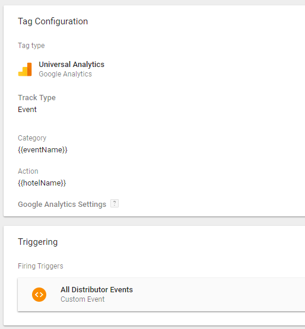
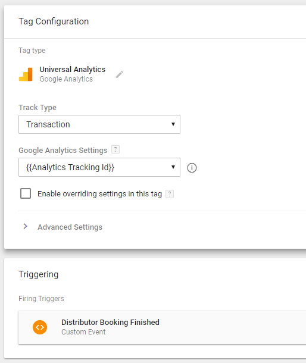
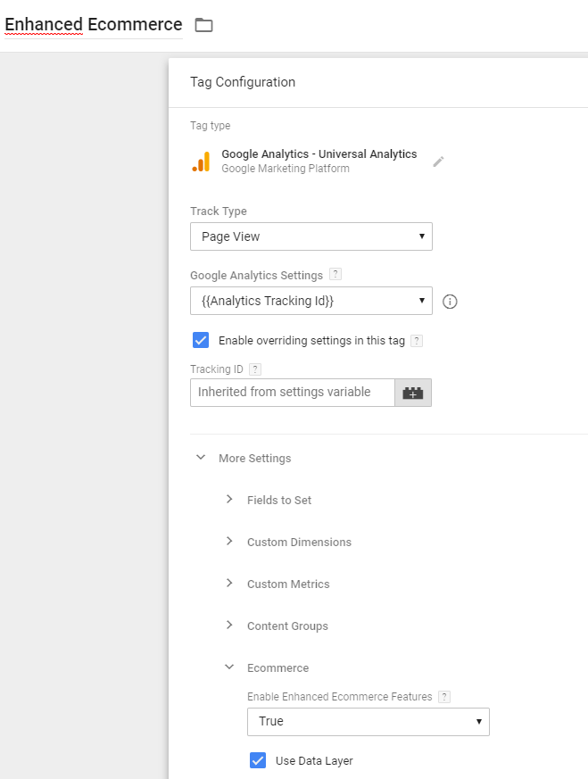

# Google Tag Manager

> **Notice of usage:** Google Tag Manager is a 3rd party service and we provide this integration as is. We export a set of supported events and their data to the container, however, we have no control over what happens to them and how they are used. Below we provide a set of basic setup examples that have been tested and verified to work with the Mews Booking Engine. If you need a more complex setup, it is up to you to configure and test it.

This guide assumes you have at least a basic knowledge of [Google Tag Manager](https://www.google.com/analytics/tag-manager/) - how to create and publish a container, how to set up triggers and custom events and how to connect them to tags.

## Enabling Google Tag Manager in Mews Booking Engine

You can enable Google Tag Manager (GTM) by setting up your GTM container’s ID in the booking engine's configuration in __Mews Operations__.
The ID has format `GTM-XXXXXX` and you can find it in Google Tag Manager.

> **Important:** It is not enough to just copy and paste the GTM container code to a website, you have to set it up in the configuration.
> However, if you use the container on your website, Mews Booking Engine will connect to it and will not create a new one.

## Migrating to Google Tag Manager

In previous versions, Mews Booking Engine supported direct integrations with Google Analytics and Google AdWords. These legacy integrations still remain functional for backward compatibility, but will be removed completely in the near future.
We strongly suggest you migrate them to Google Tag Manager.

> **Important:** If you enable Google Tag Manager in Mews Booking Engine, it will take precedence over any legacy integration, and those will not be triggered.
> This means that once you enable Google Tag Manager, you will have to migrate all of your integrations to it!

## Triggers

This is a basic description of how to set up a Mews Booking Engine event as a Trigger.
For a full list of events, see the [Google Triggers Reference](google-triggers-reference.md).

For an integration with Google Tag Manager, Mews Booking Engine provides a set of Custom Events that you can set up as Triggers. To set up a Trigger for an event, match it with its name:

If you want to track multiple events with one Trigger, you can easily use regex matching on an event name. For example, `^distributor` will track every booking engine \/ distributor event, which can be useful for setting a Trigger for Universal Analytics:

## Basic setups

### Universal Analytics

You can track all the events for further statistical computations about behaviour of your customers. Use the Google Universal Analytics tag with the `Event` track type.
The Trigger should be a regex grouping of all the events you want to track \(to track all events, you can use `^distributor` regex, as described above\).

### Google Ecommerce

You can track transactions with the Google Universal Analytics tag using the `Transaction` track type on the `distributorBookingFinished` event.
All the data needed for tracking is set in the Tag Manager’s _data layer_ and will be passed automatically.

Each reservation is sent as _Product_ with quantity set to 1; the name of the reserved category is sent as _Product name_; the name of the hotel is sent as _Product category_.

### Google Enhanced Ecommerce

We also publish all interesting data for enhanced e-commerce tracking. To track these, set up a tag with the `Enable overriding settings in this tag` option enabled, then under **More Settings &gt; Ecommerce**, set option `Enable Enhanced Ecommerce Features` to `True` and check `Use Data Layer`. The trigger should be set to all booking engine \/ distributor events as described previously.

The Track Type of the event shouldn't be important in this case, you can even re-use the same tag as for tracking all booking engine \/ distributor events in analytics.
Be sure to also enable Enhanced Ecommerce in your Google Analytics, under **Admin &gt; Ecommerce** settings. The Enhanced Ecommerce plug-in should not be used alongside the Ecommerce plug-in for the same property.

#### Tracking with Mews Payments and source attribution

When you have Mews Payments set up, a payment by a customer is legally required to happen in our domain. Therefore, all the transactions during a check-out are attributed to Mews domain.
This is an unfortunate limitation of the check-out process that we cannot currently overcome.

## Conditionally firing tags based on tracking consents

Google Tag Manager integrations are very often used to track users, be it with cookies or other approaches. You can use [Tracking Consents](google-triggers-reference.md#trackingconsents) and Google Tag Manager to use integrations only when permitted.
A commonly used integration which often needs a tracking consent is Universal Analytics.
Let's see how you can fire Universal Analytics tag only when [Tracking Consents](google-triggers-reference.md#trackingconsents) permit it.

1. **Set up Universal Analytics in Google Tag Manager**
	* See previous section about [Universal Analytics](#universal-analytics)

2. **Let Mews Booking Engine know what the tracking consents should be**
	* Call the Javascript API methods [enableTracking](../reference.md#enabletracking) or [disableTracking](../reference.md#disabletracking) when the Booking Engine Widget starts
	* Calling the Javascript API methods at the start guarantees all events have the correct consents
	* Don't rely on defaults, since they can be changed in the future; defaults are there only for backwards compatibility
	* You can also call mentioned Javascript API functions again later, e.g. after the user agrees with tracking in your cookie banner

3. **Create data layer variable for performance tracking consent**
	* Open Google Tag Manager
	* Go to "Variables" section
	* Click "New"
	* Name the variable, e.g. `performanceConsent`
	* Select "Variable Type" to be "Data Layer Variable"
	* Set the "Data Layer Variable Name" to `trackingConsents.performance`
	* Click "Save"

4. **Create trigger for all booking engine events where performance consent is given/true**
	* Go to "Triggers"
	* Click "New"
	* Name the trigger, e.g. "All Booking Engine events with performance consent"
	* Select trigger type "Custom Event"
	* Inside "Event name" add `^distributor`
	* Tick "Use regex matching"
	* Select "Some Custom Events"
	* Select condition `performanceConsent equals true`
	* Click "Save"

5. **Use created trigger to fire Universal Analytics tag**
	* Go to "Tags"
	* Click Universal Analytics tag
	* Click inside "Triggering" section
	* Remove previous trigger(s) for booking engine events if there are any
	* Add trigger "All Booking Engine events with performance consent"
	* Click "Save"

6. **All set up!**
	* Preview or submit your changes
	* From now on, Universal Analytics will fire only when the performance consent is given

## Troubleshooting

### There are no events or ecommerce transactions tracked after a redirect to the Mews Merchant page

You have probably included the container in your website, however, you haven’t set the container id in Distributor. Meaning that after the redirect, Distributor will not know anything about your container. You should set up your GTM container’s id in the Distributor's configuration in Mews Commander.

### I’ve set up the container correctly but there are still no events tracked

If you have everything set up correctly and you still cannot see events tracked, please, ensure that you’re not using any ad-blocking or similar software in your browser. They tend to block not only ads, but also tracking software like Google Tag Manager. Disabling the software for testing or adding your website to the exceptions should solve the issue.

> Important: If you are using Mews Payments, you need to disable the software for the \*.mews.com domain too.

### The Tag Assistant Chrome extension shows me a warning about multiple installations, but I use only one

Distributor includes our Mews Google Tag Manager container \(id`GTM-M7JV35D`\) to keep statistics in our own Google Analytics. We use that data for a global Distributor performance measuring, to have an idea about performance in hotels that don’t use Analytics and for the ability to build our own statistics on top of the Analytics API in Commander.

Having multiple installations is perfectly fine, if you keep a common data layer name for all of them, which we do. Please, see the official documentation: [https://developers.google.com/tag-manager/devguide\#multiple-containers](https://developers.google.com/tag-manager/devguide#multiple-containers)

| Next |
| :-- |
| [Google Triggers Reference](google-triggers-reference.md) |
