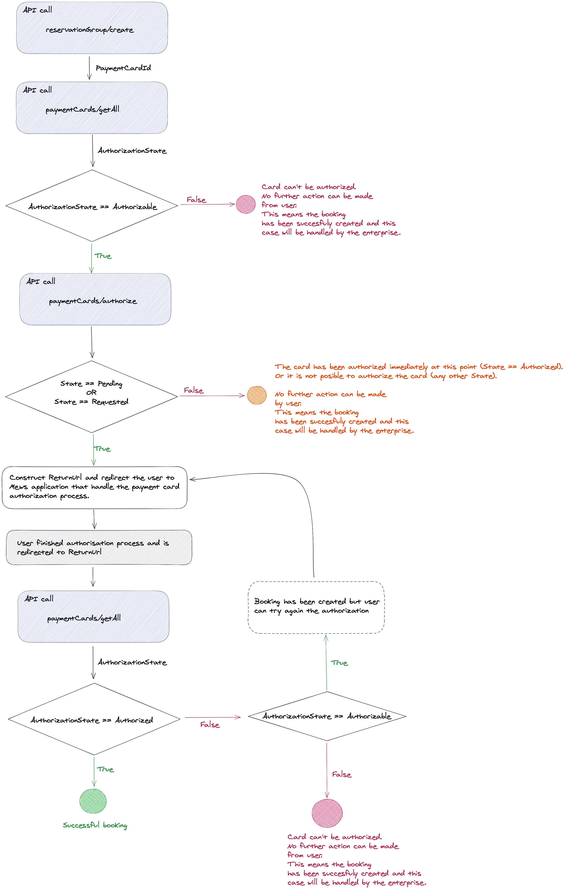

# On session payment card authorization

Whenever a user create reservation there is an option to let the guest insert a payment card which will be stored in Mews.
You can read more about how to support payment cards in booking engine application in our [use-case](./how-to-support-payment-cards-in-booking-engine-application.md).
With PSD2 directive it might be handy for the enterprise to authorize the card for smooth payments in the future. This can minimize
the risk of a future payment being rejected.

## Creating a reservation group with verified card

First step of the entire workflow is to [create a reservation group via our API](../operations.md#request-apibaseurlapidistributorv1reservationgroupscreate) with [payment card data](./how-to-support-payment-cards-in-booking-engine-application.md).
The response contains a field `PaymentCardId` which we will use to check whether the card needs authorization via requesting details of the card [__TODO: API ENDPOINT CC GET ALL]() and validating the `AuthorizationState` of the card is `Authorizable`.
Next step is try to [TODO: authorise the card api](). The response does contain a `State` of the authorization where no further action is needed unless the `State` is `Pending` or `Requested`. In any other cases the card is either authorized without any
user action, or the authorization is not possible. In case the authorization is `Pending` or `Requested` you can redirect user to Mews application which can take care about the whole authorization process by navigating user to url `https://[MewsApplicationsBaseUrl]/navigator/card-authorization/detail/[PaymentCardId]?returnUrl=[ReturnUrl]`.
A `returnUrl` query parameter is optional and will be used by the application to return the user into your booking engine after successful payment card authorization or in case the user decides to abandon the flow. `returnUrl` value should be a `Base64` encoded absolute url e.g. in javascript via `btoa` function.
After the user returns to your booking engine you can verify the card authorization state via [__TODO: API ENDPOINT CC GET ALL]() and check the `AuthorizationState` of the card is `Authorized`.

## Step by step workflow
1. [Create new reservation group](../operations.md#request-apibaseurlapidistributorv1reservationgroupscreate) with [CreditCardData](../operations.md#creditcarddata)
2. Get `PaymentCardId` from the response
3. Validate the card `AuthorizationState` is `Authorizable` via [__TODO: API ENDPOINT CC GET ALL](). **If not the workflow ends here**.
4. Try to authorize the card via [TODO: authorise the card api]() and check the response is `Pending` or `Requested`. **If not the workflow ends here**.
5. Create a `ReturnUrl` via encoding your url by `Base64` e.g. Javascript example would be `btoa(urlWhereUserShouldReturn)`
6. Redirect the user to the gateway on url `https://[MewsApplicationsBaseUrl]/navigator/card-authorization/detail/[PaymentCardId]?returnUrl=[ReturnUrl]`. You can find out the `MewsApplicationBaseUrl` in [Environments](../environments.md) section.
7. After the user returns to the `ReturnUrl` in your booking engine you can verify the state by using [__TODO: API ENDPOINT CC GET ALL]() and verify the `AuthorizationState` is `Authorized`

### Workflow diagram

